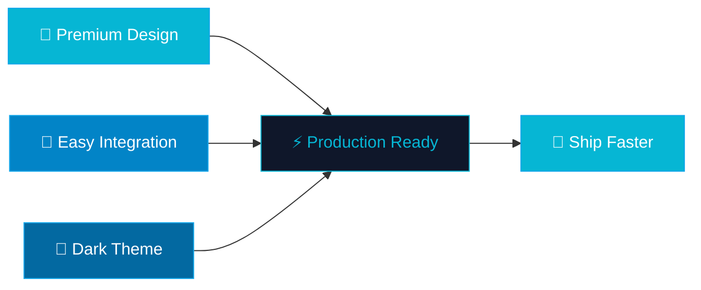
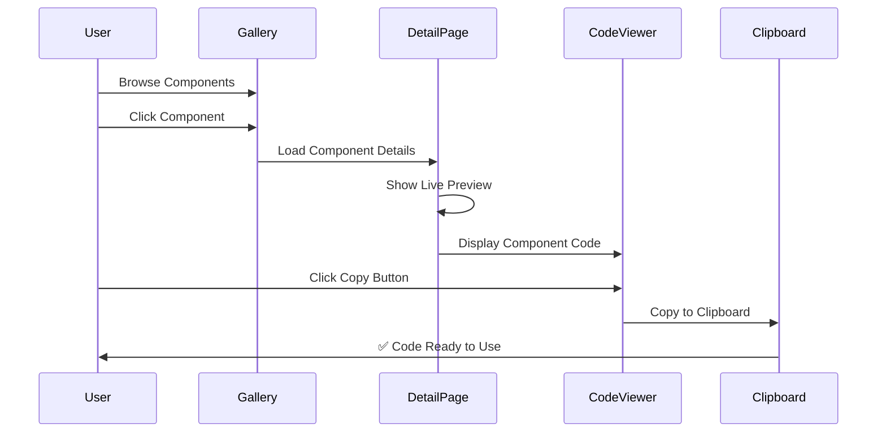
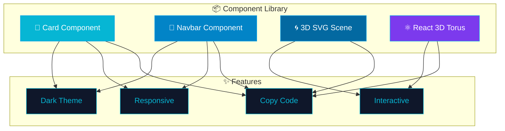
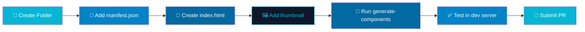
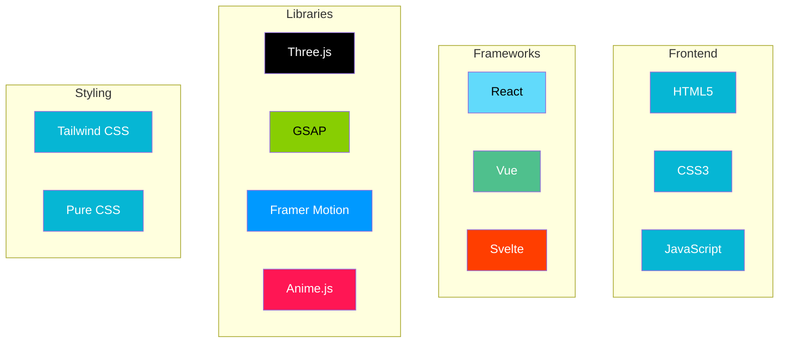
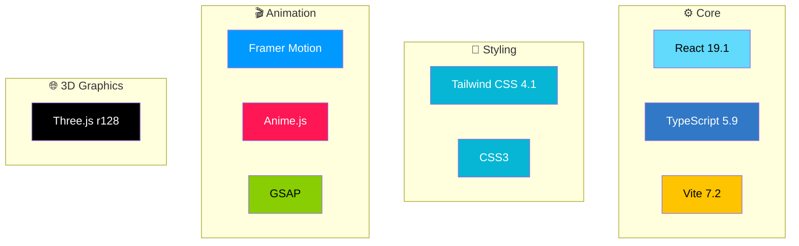

# 🎨 Velvron - Premium UI Components Library

> **Production-ready, beautifully crafted React components with dark theme aesthetics and cutting-edge web technologies.**

[](LICENSE)
[](https://reactjs.org/)
[](https://www.typescriptlang.org/)
[](https://tailwindcss.com/)
[](https://threejs.org/)

---

## ✨ Why Velvron?



### 🎯 Key Features

| Feature | Description |
|---------|-------------|
| 🎨 **Premium Design** | Carefully crafted components with modern aesthetics |
| 📱 **Fully Responsive** | Mobile-first approach, works on all devices |
| 🔧 **Easy Integration** | Copy-paste ready, no build step required |
| 🌙 **Dark Theme** | Beautiful dark blue/navy gradient theme |
| ⚡ **Performance** | Optimized with GPU acceleration |
| 🎬 **Animations** | Smooth transitions and interactive effects |
| 📦 **Multiple Libraries** | React, Three.js, GSAP, Framer Motion, and more |
| 🔓 **Open Source** | MIT Licensed, free for commercial use |

---

## 🚀 Quick Start

### Prerequisites
- **Node.js** v16+ 
- **npm** or **yarn**

### Installation & Setup

```bash
# Clone the repository
git clone https://github.com/evilshxt/uicomponents.git
cd uicomponents

# Install dependencies
npm install

# Start development server
npm run dev

# Open in browser
# → http://localhost:5173
```

### Build for Production

```bash
npm run build
```

---

## 📚 How to Use Components



### 3 Simple Steps

1. **Browse** the component gallery
2. **Preview** the live demo
3. **Copy** the code and integrate into your project

Each component includes:
- ✅ Live interactive preview
- ✅ Full source code with syntax highlighting
- ✅ Copy-to-clipboard functionality
- ✅ Component metadata (dependencies, tags, author)
- ✅ Responsive design showcase

---

## 🎁 Available Components



| Component | Category | Tech Stack | Status |
|-----------|----------|-----------|--------|
| **Card** | Layout | HTML/CSS/Tailwind | ✅ Production |
| **Navbar** | Navigation | HTML/CSS/Tailwind | ✅ Production |
| **3D SVG Scene** | 3D Graphics | Three.js/Vanilla JS | ✅ Production |
| **React 3D Torus** | 3D Graphics | React/Three.js | ✅ Production |

---

## 🤝 Contributing Components

### Step-by-Step Guide



### 1️⃣ Create Component Folder

```bash
mkdir -p public/library/your-component-name
cd public/library/your-component-name
```

### 2️⃣ Add `manifest.json`

```json
{
  "name": "your-component-name",
  "category": "Category Name",
  "description": "Brief description of your component",
  "tags": ["tag1", "tag2", "tag3"],
  "author": "Your Name",
  "languages": ["html", "css", "js"],
  "dependencies": ["library1", "library2"]
}
```

### 3️⃣ Create `index.html` Demo

```html
<!DOCTYPE html>
<html lang="en">
<head>
    <meta charset="UTF-8">
    <meta name="viewport" content="width=device-width, initial-scale=1.0">
    <title>Your Component</title>
    <script src="https://cdn.tailwindcss.com"></script>
</head>
<body class="bg-gradient-to-b from-slate-950 via-slate-900 to-slate-950">
    <div id="demo">
        <!-- Your component here -->
    </div>
    <script>
        // Your component code
    </script>
</body>
</html>
```

### 4️⃣ Add Thumbnail (Optional)

- Size: **400x300px**
- Format: **JPG or PNG**
- File: `thumbnail.jpg` or `thumbnail.png`

### 5️⃣ Generate & Test

```bash
# Update component registry
npm run generate-components

# Start dev server
npm run dev

# Navigate to http://localhost:5173/components/your-component-name
```

### 6️⃣ Submit Pull Request

- ✅ All files properly formatted
- ✅ Component tested and working
- ✅ Documentation updated
- ✅ Follows component guidelines

---

## 📋 Component Guidelines

| Guideline | Details |
|-----------|---------|
| 🏗️ **HTML** | Use semantic HTML5 elements |
| 📱 **Responsive** | Mobile-first design approach |
| ♿ **Accessibility** | ARIA labels, keyboard navigation |
| ⚡ **Performance** | Optimize bundle size, lazy load images |
| 🎨 **Styling** | Match dark theme, use Tailwind CSS |
| 🧪 **Testing** | Test on Chrome, Firefox, Safari, Edge |
| 📚 **Code Style** | Follow existing patterns and conventions |

---

## 🛠️ Supported Technologies



**All components run in isolated iframes** - no library conflicts! 🎉

---

## 🤖 Tech Stack



---

## 📊 Project Stats

| Metric | Value |
|--------|-------|
| 📦 Components | 4 Production-Ready |
| 🎨 Themes | Dark Blue/Navy |
| 📱 Responsive | Mobile-First |
| ⚡ Performance | GPU Accelerated |
| 🔓 License | MIT (Free) |
| 🌍 Browser Support | All Modern Browsers |

---

## 🚀 Getting Help

- 📖 **Documentation**: Check the README and component guides
- 🐛 **Issues**: Report bugs on GitHub
- 💬 **Discussions**: Join our community discussions
- 🎯 **Contributing**: See [Contributing Guide](CONTRIBUTING.md)

---

## 📝 License

This project is licensed under the **MIT License** - free for commercial and personal use.

See the [LICENSE](LICENSE) file for full details.

---

## 🙌 Built With Love By

**Velvron Team** - Creating beautiful, production-ready UI components.

```
Made with ❤️ by Velvron Labs for developers who care about design
```

---

## ⭐ Show Your Support

If you find Velvron useful, please consider:
- ⭐ Starring the repository
- 🔗 Sharing with your network
- 🤝 Contributing components
- 💬 Providing feedback

---

**Happy Building! 🚀**
